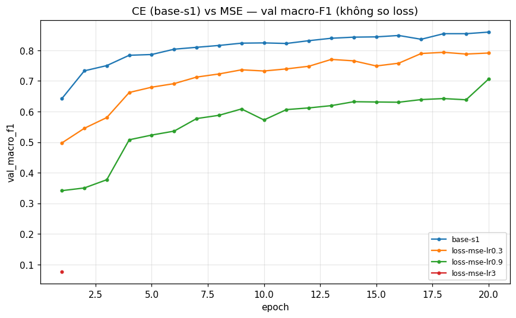
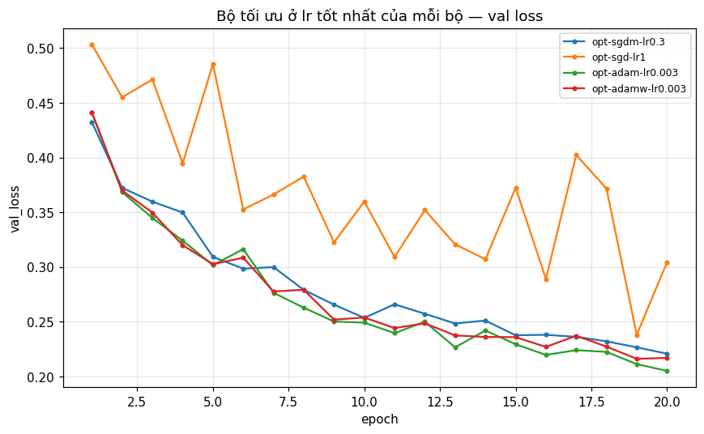
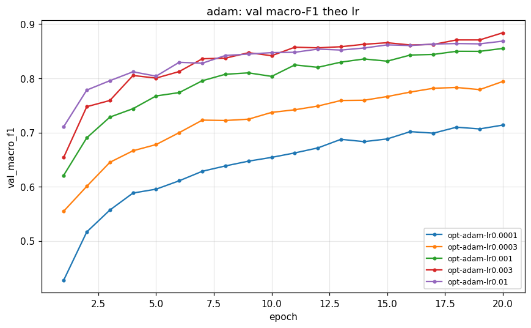
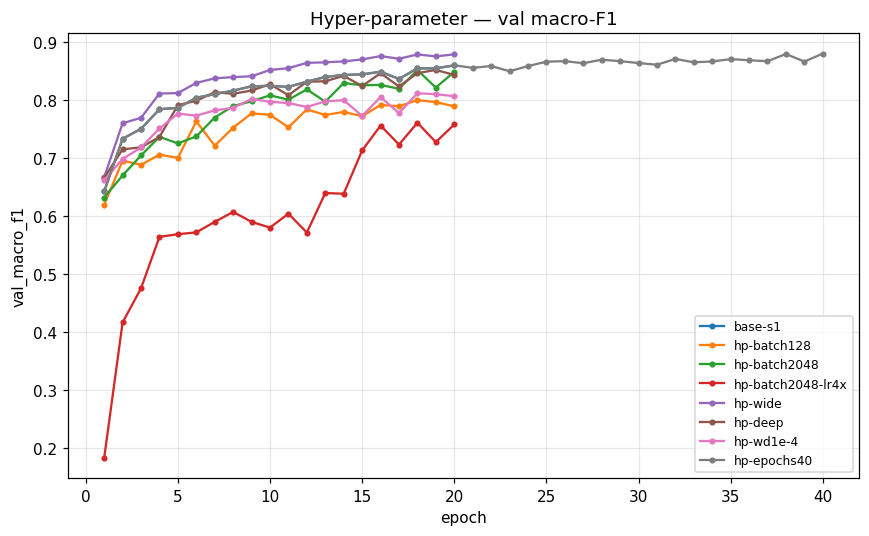
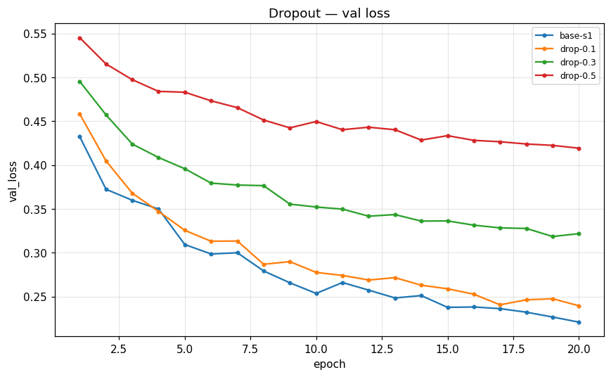
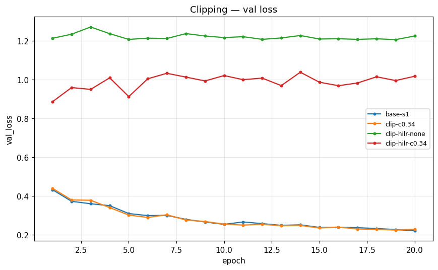
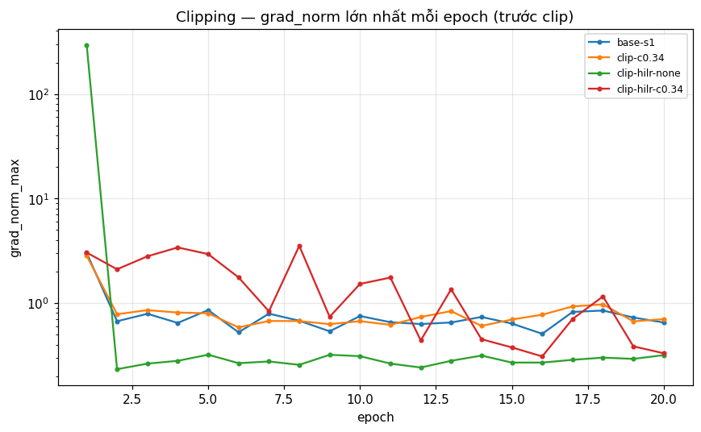
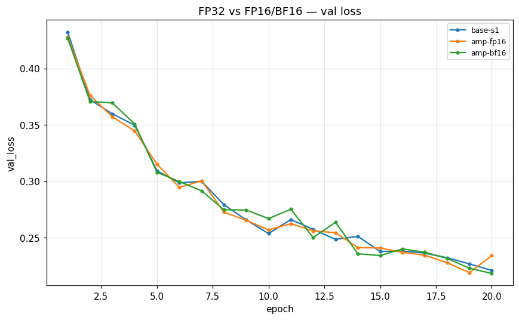
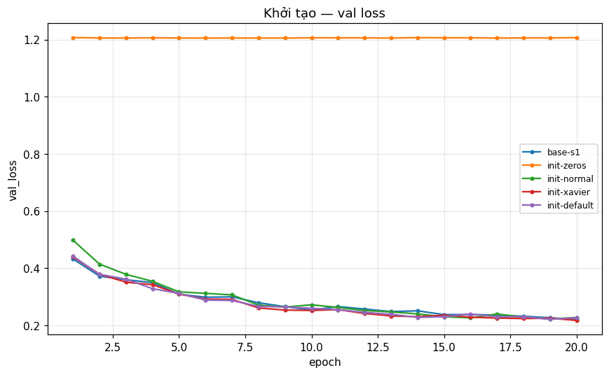

# Báo cáo Lab Day 1 — <Họ tên> — <MSSV>

> **Khung báo cáo — điền sau khi chạy notebook.** Mọi chỗ `<...>` là phần bạn điền từ output của `code/lab.ipynb` / `experiments.xlsx`. Mỗi kết luận cần: số (trỏ về `exp_id`) + ảnh + cơ chế + so với nhiễu 2σ. Xoá dòng này và các dòng hướng dẫn `>` khi nộp.

## 1. Thiết lập

- Môi trường: Colab/Kaggle, GPU `<T4?>`, PyTorch `<phiên bản>` (in ở ô đầu của notebook).
- Dữ liệu: Forest CoverType; `train` 464 809 / `eval` 116 203 theo `split_metadata.csv`. Validation: 20% của train (phân tầng, seed 42) → 371 847 train / 92 962 val. Chuẩn hoá 10 cột số bằng mean/std của phần train còn lại.
- Model: `M-base` (54→256→128→7, 47 879 tham số, ReLU, không softmax trong model). Baseline: CE, SGD+momentum 0.9, lr = `<BASE_LR chọn bằng val>`, batch 512, 20 epoch, He init, dropout 0, không clip, FP32.
- Mốc tham chiếu: accuracy "đoán lớp đa số" trên val = `<0.4876>`.
- Các chủ đề đã thử: ☑ loss ☑ optimizer ☑ hyper-parameter ☑ dropout ☑ clipping ☑ mixed precision ☑ init *(bỏ dấu ☑ chủ đề nào bạn không chạy / bị lỗi)*

## 2. Kiểm tra ban đầu và độ nhiễu

| Kiểm tra | Kết quả |
|---|---|
| Số tham số / shape logits | 47 879 / (B, 7) |
| Loss bước 0 (so với ln 7 = 1,946) | `<...>` (He init cho loss bước 0 cao hơn ln 7 vì lớp cuối cũng có phương sai 2/n_in) |
| Quá khớp 20 mẫu: loss cuối | `<...>` |
| Mọi tham số có gradient khác 0 | ☑ có |
| Baseline, số seed đã chạy | 5 (`base-s1..s5`) |
| Baseline: val acc (TB ± σ) | `<...>` ± `<...>` |
| Baseline: val macro-F1 (TB ± σ) | `<...>` ± `<...>` |

**Ngưỡng nhiễu dùng trong báo cáo:** 2σ = `<...>` (val macro-F1; từ sheet `Seeds`). Hình: `figures/base-s1.png`; mô tả đường cong: `<còn giảm? best epoch? quá khớp?>`.

## 3. Kết quả theo chủ đề

> Mỗi chủ đề: (a) dự đoán trước (đã ghi trong notebook), (b) kết quả (số + ảnh + `exp_id`), (c) cơ chế, (d) vượt nhiễu không. Tất cả dựa trên **val**.

### 3.1 Hàm mất mát — CE vs MSE
- Dự đoán: `<...>`
- Kết quả (`base-s1`, `loss-mse-lr*`; ): `<val macro-F1 / acc / tốc độ hội tụ; vượt 2σ?>`
- Giải thích (gradient CE `softmax−y` vs MSE `2(z−y)/(7B)`; không so loss trực tiếp): `<...>`

### 3.2 Bộ tối ưu hoá
- Dự đoán: `<...>`
- Mỗi bộ ở lr tốt nhất của nó:

| Bộ tối ưu | exp_id | lr | val macro-F1 | best epoch |
|---|---|---|---|---|
| SGD | `<...>` | | | |
| SGD+momentum | `<...>` | | | |
| Adam | `<...>` | | | |
| AdamW | `<...>` | | | |

- Độ nhạy với lr:   — `<bộ nào ổn định hơn; lr nào dao động/chậm>`
- Adam vs AdamW(wd=0) (`opt-adamw-wd0`): `<trùng nhau?>`
- Giải thích: `<...>`

### 3.3 Hyper-parameter
- Yếu tố đã đổi (`hp-*`; ): `<batch, độ rộng/sâu, weight decay, epoch; số bước cập nhật (batch 128/512/2048 = 2906/727/182 bước/epoch); thời gian/epoch>`

### 3.4 Dropout
- (`drop-*`; ) Khoảng cách train–val loss: `<...>`. Mô hình có thực sự quá khớp không? `<...>`

### 3.5 Gradient clipping
- `grad_norm` của baseline → chọn `c = <...>` (`clip-c*`; tỉ lệ bước bị clip `<...>`).
- Ở lr ×10 (`clip-hilr-none` vs `clip-hilr-c*`;  ): `<không clip: ...; có clip: ...>`

### 3.6 Mixed precision
- FP32 vs FP16 vs BF16 (`amp-fp16`, `amp-bf16`; ): thời gian/epoch `<...>`, bộ nhớ cực đại `<...>` (gồm cả dữ liệu trên GPU), val macro-F1 `<...>`.
- Giải thích (kể cả khi không nhanh hơn): `<chi phí gọi kernel của mạng nhỏ; FP16 cần GradScaler, BF16 thì không vì cùng số mũ với FP32>`

### 3.7 Khởi tạo tham số
- Độ lệch chuẩn kích hoạt theo lớp và loss bước 0 (bảng in ở mục 3.7 của notebook; ): `<dán bảng>`
- `zeros`: `<gradient lớp ẩn = 0 vì ReLU(0)=0 và đối xứng → chỉ bias lớp ra học>`; `normal`: `<kích hoạt co dần theo lớp>`.

## 4. Đánh giá cuối trên tập eval

> Số lấy từ `eval_result.json` / output notebook (do `scripts/evaluate.py` tạo).

| Cấu hình | Seed nộp | val macro-F1 | **eval macro-F1** | eval accuracy |
|---|---|---|---|---|
| Baseline (TB 5 seed) | — | `<...>` | `<...>` ± `<...>` | `<...>` |
| Cấu hình cuối cùng (TB 3 seed) | final-s1 | `<...>` | `<...>` ± `<...>` | `<...>` |

- Cấu hình cuối cùng gồm: `<optimizer, lr, hidden, epochs>` — chọn bằng val trong số 3 ứng viên `fin-cand-*` (`<lý do>`).
- Cải thiện so với baseline trên eval: `<Δ>`, so với 2σ = `<...>`: `<vượt nhiễu?>`
- Val và eval: `<gần nhau? chênh bao nhiêu?>`

### 4.1 Phân tích lỗi theo lớp

| Lớp | support | precision | recall | F1 |
|---|---|---|---|---|
| 0 Spruce/Fir | | | | |
| 1 Lodgepole | | | | |
| 2 Ponderosa | | | | |
| 3 Cottonwood | | | | |
| 4 Aspen | | | | |
| 5 Douglas-fir | | | | |
| 6 Krummholz | | | | |

- Lớp khó nhất là lớp `<...>` (F1 = `<...>`), hay bị nhầm với lớp `<...>` (ma trận nhầm lẫn trong `eval_result.json`).
- Lý giải (số mẫu ít / đặc trưng giống / mất cân bằng) và một cách cải thiện: `<...>`

## 5. Trả lời các câu hỏi dẫn dắt

1. **Bộ tối ưu nào "thắng" khi mỗi cái được chỉnh lr công bằng? Khi lr không được chỉnh thì sao?** `<...>`
2. **Dropout có giúp không khi mô hình chưa quá khớp? Khi nào nên dùng?** `<...>`
3. **Gradient clipping giải quyết vấn đề gì? Quan sát nào chứng minh?** `<...>`
4. **Mixed precision có nhanh hơn trên mạng và dữ liệu này không? Vì sao (không)?** `<...>`
5. **Vì sao khởi tạo toàn số 0 hỏng? He khác Xavier ở đâu, khi nào quan trọng?** `<...>`
6. **Quay lại câu hỏi của bài học (loss không giảm sau 2 000 bước): 3 phép kiểm tra đầu tiên?** (1) loss bước 0 ≈ ln 7 (khởi tạo/nhãn/chuẩn hoá đúng không); (2) quá khớp được 1 lô 20 mẫu với mọi chính quy hoá tắt (phân biệt lỗi code với thiếu năng lực); (3) mọi tham số có gradient khác 0 và `grad_norm` (gradient có chảy không, có quá nhỏ/NaN không) — kèm bằng chứng từ `<các thí nghiệm của bạn: init-zeros, quá khớp 20 mẫu, clip-hilr-none, ...>`.

## 6. Hạn chế và điều bất ngờ

- Kết quả khác dự đoán: `<...>`
- Hạn chế thiết kế: `<5 seed baseline cho σ thô; cùng số epoch nhưng khác số bước; lưới lr thô và có thể chạm mép; mạng chưa hội tụ hẳn sau 20 epoch; chỉ 1 seed cho mỗi cấu hình thí nghiệm>`
- Nếu có thêm thời gian: `<...>`

## 7. Phụ lục

- File đã nộp: `REPORT.md`, `experiments.xlsx`, `predictions_eval.csv`, `eval_result.json`, `figures/`, `results/`, `code/`.
- Thời gian chạy ước tính tổng cộng: `<...>`
